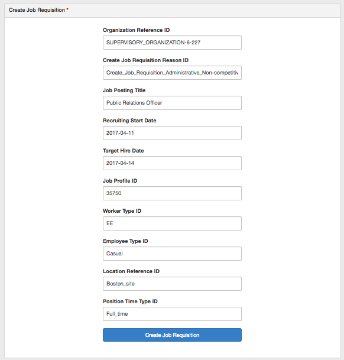
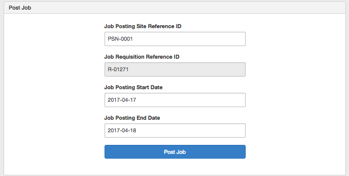
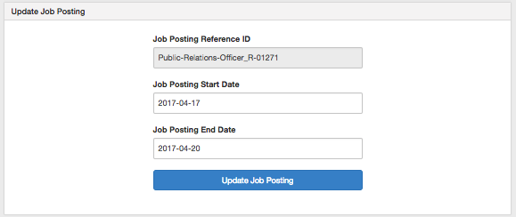
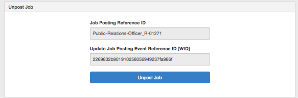
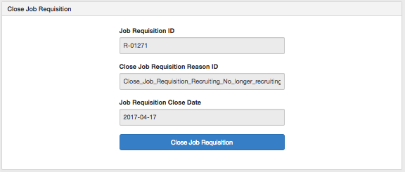
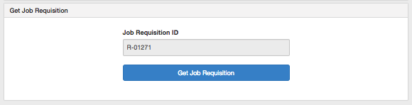
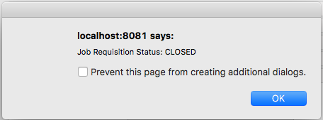

Workday Anypoint Connector Demo - Post-Update-Unpost job 
=================================================================

## Introduction

The present demo is an application that provides a **complete workflow** to sequentially invoke some of Workday's standard operations.

## Prerequisites

* Java 8
* Anypoint Studio 7.x
* Mule Runtime 4.1.x EE or higher
* APIKit
* DataWeave
* Access to a Workday account

## Import the project

* Go to **File > Import**.
* Select **Anypoint Studio Project from External Location** (under the parent folder "Anypoint Studio").
* Provide the root **path to the demo** project folder.
* Select **Mule Runtime (4.1.x EE)**.
* Click **Finish**.
* Set credentials inside the file `src/main/resources/mule-app.properties`.

   ```
   workday.username=
   workday.password=
   workday.tenantname=
   workday.hostname=
   ```

* Open the **Global Element Configuration**.

   

* Click the **Test Connection** button to ensure there is connectivity with the sandbox. A successful message should pop-up.

## Run the demo

* Go to **Run > Run As > Mule Application**. 

## Post-Update-Unpost job 

* Open a browser and access the URL **http://localhost:8081/**. You should see the **Create Job Requisition form**.

   

* Click on **Create Job Requisition** button.
* Click on **Post Job** button under **Post Job form**.

   

* Click on **Update Job Posting** button under the **Update Job Posting form**.

   

* Click on **Unpost Job** button under the **Unpost Job form**.
I
   
    
* Click on **Close Job Requisition** button under the **Close Job Requisition form**.

   

* Click on **Get Job Requisition** button under the **Get Job Requisition form**.

   
    
* A successful message with Job Requisition status information should appear.

   

## See more
* For additional technical information on the Workday Connector, visit our [technical reference documentation](https://docs.mulesoft.com/connectors/workday/workday-reference) or refer to the [Workday Documentation Site](https://docs.mulesoft.com/connectors/workday/workday-connector).
* For more information on Workday, go to the [Workday API site](https://community.workday.com/api). 
